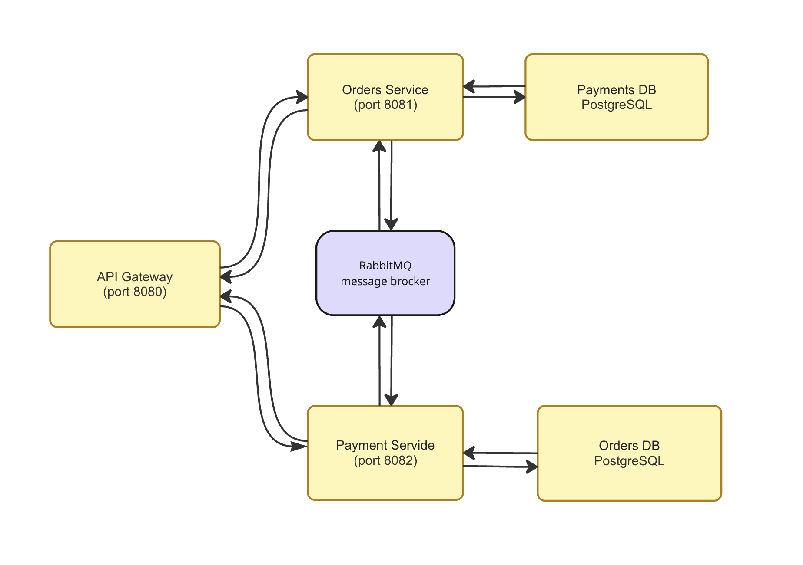
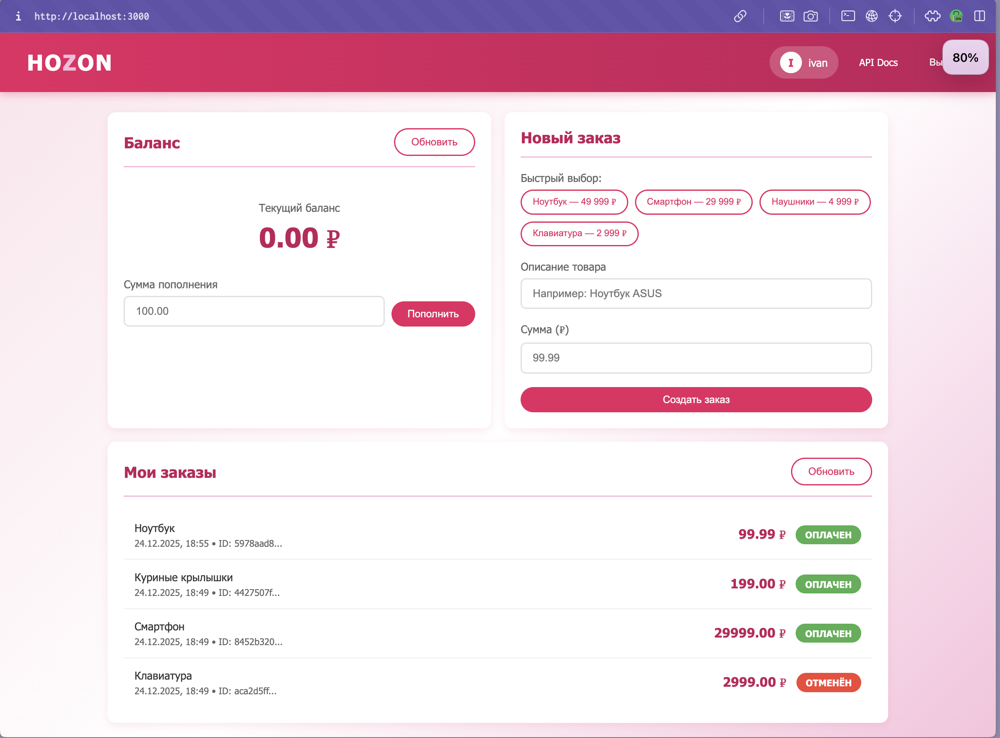

# HOZON - Микросервисная платформа электронной коммерции

ДЗ-4 по предмету "Констуирование ПО"

## Архитектура



## Технологии

- **Язык**: C++17
- **HTTP Server**: Custom implementation (socket-based)
- **Message Broker**: RabbitMQ
- **Database**: PostgreSQL
- **Build System**: CMake
- **Контейнеризация**: Docker, docker-compose
- **Frontend**: React 18 + TypeScript + Vite
- **API Documentation**: Swagger UI (OpenAPI 3.0)

## Паттерны

### Transactional Outbox

Используется в Orders Service и Payments Service для гарантированной доставки сообщений.

### Transactional Inbox

Используется в Payments Service для идемпотентной обработки входящих сообщений.

### Compare-and-Swap (CAS)

Используется для атомарного обновления баланса с оптимистичной блокировкой.

### Exactly-once семантика

Достигается через:

- Уникальный `order_id` в таблице транзакций
- Transactional Inbox с дедупликацией по `message_id`

## Быстрый старт

### Запуск через Docker Compose

```bash
# Клонирование репозитория
git clone <repo-url>
cd HOZON

# Запуск всей системы
docker-compose up --build

# Или в фоновом режиме
docker-compose up --build -d
```

### Доступные сервисы


| Сервис | URL                    | Описание                                     |
| ------------ | ---------------------- | ---------------------------------------------------- |
| Frontend     | http://localhost:3000  | Web-приложение                             |
| Swagger UI   | http://localhost:8888  | API документация                         |
| API Gateway  | http://localhost:8080  | REST API                                             |
| RabbitMQ     | http://localhost:15672 | Панель управления очередями |

### Проверка здоровья сервисов

```bash
# API Gateway
curl http://localhost:8080/health

# Orders Service
curl http://localhost:8080/api/orders/health

# Payments Service
curl http://localhost:8080/api/payments/health
```

## API Endpoints

### Payments Service (`/api/accounts/*`)


| Method | Endpoint                             | Описание              |
| ------ | ------------------------------------ | ----------------------------- |
| POST   | `/api/accounts?user_id=<id>`         | Создать счёт       |
| POST   | `/api/accounts/deposit?user_id=<id>` | Пополнить счёт   |
| GET    | `/api/accounts/balance?user_id=<id>` | Получить баланс |

### Orders Service (`/api/orders/*`)


| Method | Endpoint                   | Описание            |
| ------ | -------------------------- | --------------------------- |
| POST   | `/api/orders?user_id=<id>` | Создать заказ   |
| GET    | `/api/orders?user_id=<id>` | Список заказов |
| GET    | `/api/orders/{id}`         | Статус заказа   |

## Примеры использования

### 1. Создание счёта

```bash
curl -X POST "http://localhost:8080/api/accounts?user_id=ivan"
```

### 2. Пополнение счёта

```bash
curl -X POST "http://localhost:8080/api/accounts/deposit?user_id=ivan" \
  -H "Content-Type: application/json" \
  -d '{"amount": 1000}'
```

### 3. Проверка баланса

```bash
curl "http://localhost:8080/api/accounts/balance?user_id=ivan"
```

### 4. Создание заказа

```bash
curl -X POST "http://localhost:8080/api/orders?user_id=ivan" \
  -H "Content-Type: application/json" \
  -d '{"amount": 99.99, "description": "Ноутбук"}'
```

### 5. Просмотр заказов

```bash
curl "http://localhost:8080/api/orders?user_id=ivan"
```

### 6. Статус конкретного заказа

```bash
curl "http://localhost:8080/api/orders/<order_id>"
```

## Статусы заказов


| Статус | Описание                                                                                             |
| ------------ | ------------------------------------------------------------------------------------------------------------ |
| `NEW`        | Заказ создан, ожидает оплаты                                                         |
| `FINISHED`   | Оплата прошла успешно                                                                     |
| `CANCELLED`  | Оплата не удалась (недостаточно средств или счёт не найден) |


## RabbitMQ Management

Веб-интерфейс RabbitMQ доступен по адресу: http://localhost:15672

- Login: `guest`
- Password: `guest`

## Frontend Application

Веб-приложение доступно по адресу: http://localhost:3000



Основной фукнционал:

- Регистрация/авторизация пользователей
- Просмотр и пополнение баланса
- Создание заказов с быстрым выбором товаров
- Отслеживание статуса заказов в реальном времени

## Структура проекта

```
HOZON/
├── CMakeLists.txt              # Корневой CMake файл
├── docker-compose.yml          # Docker Compose конфигурация
├── README.md                   # Документация
│
├── common/                     # Общая библиотека
│   ├── CMakeLists.txt
│   ├── include/
│   │   ├── config.h           # Конфигурация через env
│   │   ├── database.h         # PostgreSQL обёртка
│   │   ├── http_client.h      # HTTP клиент
│   │   ├── http_server.h      # HTTP сервер
│   │   ├── json.h             # nlohmann/json
│   │   ├── message_types.h    # Типы сообщений
│   │   ├── rabbitmq.h         # RabbitMQ обёртка
│   │   └── uuid.h             # UUID генератор
│   └── src/
│       └── *.cpp              # Реализации
│
├── api-gateway/               # API Gateway сервис
│   ├── Dockerfile
│   ├── CMakeLists.txt
│   └── src/
│       ├── main.cpp
│       ├── router.h
│       └── router.cpp
│
├── orders-service/            # Orders Service
│   ├── Dockerfile
│   ├── CMakeLists.txt
│   ├── sql/init.sql          # Схема БД
│   └── src/
│       ├── main.cpp
│       ├── handlers/         # HTTP обработчики
│       ├── models/           # Модели данных
│       ├── repository/       # Работа с БД
│       └── workers/          # Outbox Worker, Result Consumer
│
├── payments-service/          # Payments Service
│   ├── Dockerfile
│   ├── CMakeLists.txt
│   ├── sql/init.sql          # Схема БД
│   └── src/
│       ├── main.cpp
│       ├── handlers/         # HTTP обработчики
│       ├── models/           # Модели данных
│       ├── repository/       # Работа с БД
│       └── workers/          # Inbox Worker, Outbox Worker
│
├── frontend/                  # React Frontend
│   ├── Dockerfile
│   ├── package.json
│   ├── vite.config.ts
│   ├── index.html
│   └── src/
│       ├── main.tsx
│       ├── App.tsx
│       ├── api/              # API клиент
│       ├── components/       # React компоненты
│       └── styles/           # CSS стили
│
├── swagger/                   # Swagger UI
│   ├── Dockerfile
│   ├── openapi.yaml          # OpenAPI спецификация
│   └── index.html
│
└── postman/
    └── HOZON.postman_collection.json
```

## Остановка

```bash
docker-compose down

# С удалением данных
docker-compose down -v
```
